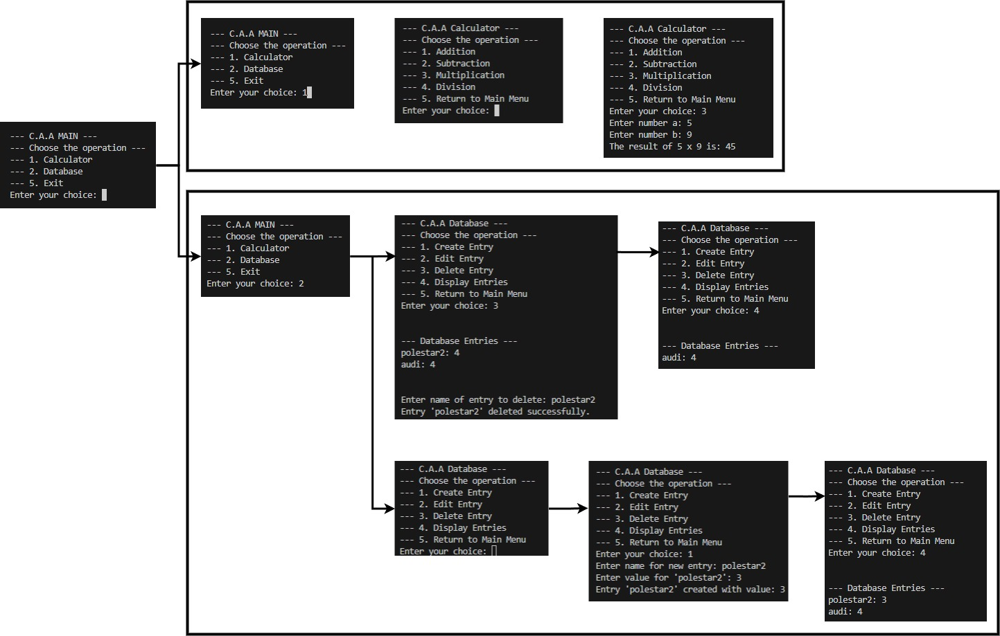

# CaseSwitch Calc & Database

Et C++-prosjekt som kombinerer en **kalkulator** og en enkel **database** lagret i fil (`database.txt`).  
Programmet er menybasert og kjører i terminalen.

## Funksjoner

### Kalkulator
- Addisjon
- Subtraksjon
- Multiplikasjon
- Divisjon (med sjekk mot null)

### Database
- Opprette nye oppføringer (`navn` + `verdi`)
- Redigere oppføringer (legg til eller trekk fra verdi)
- Slette oppføringer
- Vise alle oppføringer
- Dataene lagres automatisk i `database.txt` ved avslutning og lastes inn ved start

### Example

# Task Manager

Et C++-prosjekt som viser bruk av **objektorientert programmering (OOP)** og `switch-case` kontrollflyt.  
Programmet er menybasert og kjører i terminalen.  

## Funksjoner

### Oppgaver
- Legge til nye oppgaver (`enter <tittel>`)
- Liste alle oppgaver (`list`)
- Markere oppgaver som fullført (`done <id>`)
- Slette oppgaver (`rm <id>`)
- Avslutte programmet (`exit`)

## OOP-konsepter
- **Klasser**:  
  `Task` representerer en oppgave, mens `TaskList` håndterer en samling av oppgaver.
- **Enkapsulering**:  
  Feltene i `Task` er private, og kontrolleres via offentlige metoder.
- **Abstraksjon**:  
  Brukeren ser enkle kommandoer, mens implementasjonen skjules i klassene.
- **Switch-case**:  
  Kommandoene tolkes og styres gjennom en `switch` i hovedprogrammet.