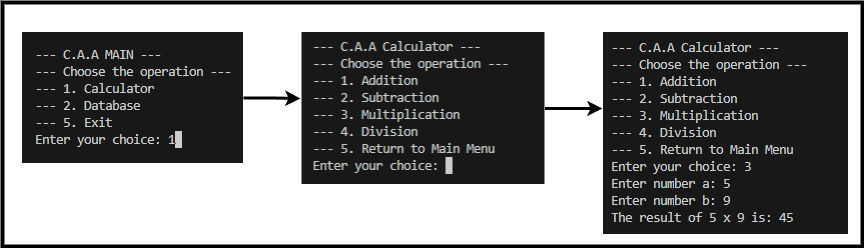

# CaseSwitch Calc & Database

A C++ project that combines a **calculator** and a simple **database** stored in a file (`database.txt`).  
The program is menu-based and runs in the terminal.

## Features

### Calculator
- Addition  
- Subtraction  
- Multiplication  
- Division (with zero check)

### Database
- Create new entries (`name` + `value`)  
- Edit entries (add or subtract value)  
- Delete entries  
- Display all entries  
- Data is automatically saved to `database.txt` on exit and loaded on startup

### Example



# Task Manager

A C++ project demonstrating the use of **object-oriented programming (OOP)** and `switch-case` control flow.  
The program is menu-based and runs in the terminal.

## Features

### Tasks
- Add new tasks (`enter <title>`)  
- List all tasks (`list`)  
- Mark tasks as completed (`done <id>`)  
- Delete tasks (`rm <id>`)  
- Exit the program (`exit`)

## OOP Concepts
- **Classes**:  
  `Task` represents an individual task, while `TaskList` manages a collection of tasks.  
- **Encapsulation**:  
  The fields in `Task` are private and controlled through public methods.  
- **Abstraction**:  
  The user interacts through simple commands, while the logic is handled internally by the classes.  
- **Switch-case**:  
  Commands are interpreted and executed through a `switch` statement in the main program.

### Example


---

## How to Compile & Run

You can compile the projects using any C++ compiler such as `g++`.

**Example (Linux / macOS):**
```bash
g++ main.cpp -o CaseSwitch
./CaseSwitch

